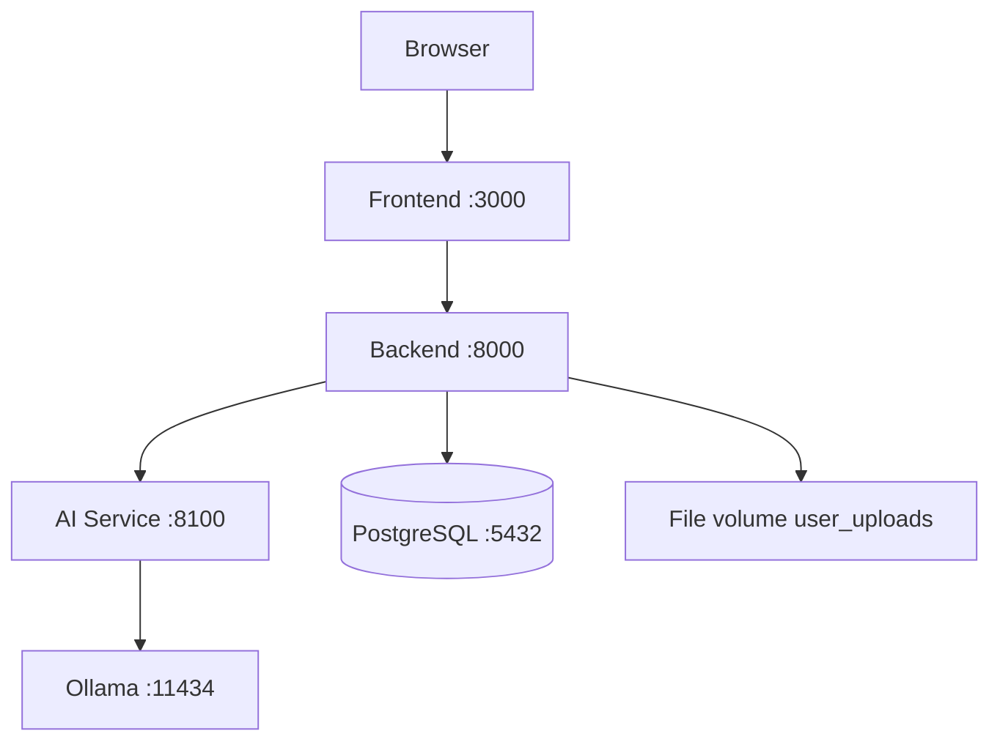
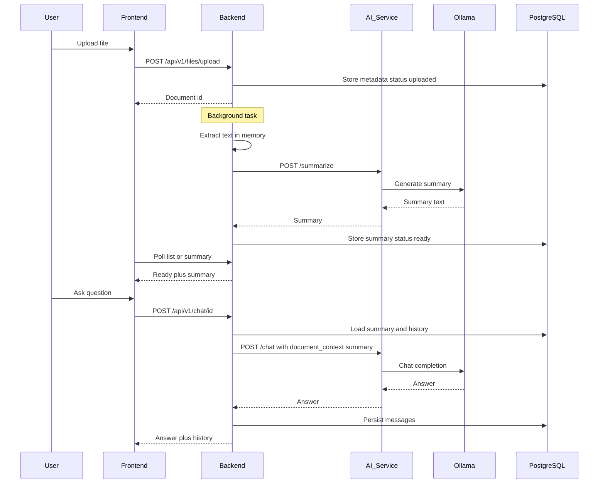

# System Architecture

This is Copyright of DocuSage 2026 Owner Rohith Kumar Vasista P.

---

## Overview

DocuSage is a **multi-service Docker application**. The browser talks only to the frontend and the main backend. The backend never calls the LLM runtime directly — it calls a dedicated **AI service**, which talks to **Ollama**.

Chat is **summary-grounded**: answers use the stored document summary (plus recent chat history), not vector retrieval over the full file.



ASCII (same layout):

```
┌────────────┐
│  Browser   │
│ (User UI)  │
└─────┬──────┘
      │
      ▼
┌────────────┐      ┌──────────────┐      ┌────────────┐
│  Frontend  │─────▶│   Backend    │─────▶│ AI Service │
│  :3000     │      │   :8000      │      │   :8100    │
└────────────┘      └──────┬───────┘      └─────┬──────┘
                           │                    │
                           ▼                    ▼
                    ┌──────────────┐      ┌────────────┐
                    │  PostgreSQL  │      │   Ollama   │
                    │   :5432      │      │   :11434   │
                    └──────────────┘      └────────────┘
                           │
                           ▼
                    ┌──────────────┐
                    │ File volume  │
                    │ user_uploads │
                    └──────────────┘
```

---

## Sequence: upload → Ready → chat



**Important:** extracted raw text is used once for summarization and is **not** kept as a searchable corpus. Chat does **not** retrieve chunks from the original file.

---

## Design principles

1. **Separation of concerns**  
   Auth, files, and orchestration live in `backend`. Model inference lives in `ai-service` + `ollama`.

2. **Isolated AI unit**  
   Swapping or upgrading the model stack should not rewrite the whole app. The backend only knows the AI HTTP API.

3. **No paid API key required (current)**  
   Local Ollama (`llama3.2:1b`) provides summarization and chat for typical laptop hardware.

4. **Modular code**  
   Backend uses `core/`, `models/`, `schemas/`, `services/`, `routers/`. Frontend uses `components/`, `hooks/`, `api/`, `config/`.

5. **Safe document lifecycle**  
   Soft delete (Trash) before permanent delete. Chat rows are cleaned up on permanent delete.

---

## Main user flows

### 1. Register / login

- Frontend collects email + password  
- Backend issues a JWT  
- Token is stored in the browser and sent on later API calls  

### 2. Upload and process a document

1. User uploads a file (max 10 MB)  
2. Backend validates type/size and quota, stores binary on disk, saves metadata in PostgreSQL  
3. Background task: extract text → request AI summary (or extractive fallback) → store summary (max 1 MB)  
4. Status moves: `uploaded` → `processing` → `ready` / `failed`  
5. Frontend polls until Ready  

### 3. View summary and chat

1. User selects a Ready document  
2. Right panel shows **Summary** (top) and **Chat** (bottom)  
3. Chat uses stored document summary as context (not the full raw extraction)  
4. Conversation history is persisted per user + document  

---

## Data stores

| Store | What it holds |
|-------|----------------|
| **PostgreSQL** | Users, document metadata, summaries, processing status, chat messages, Alembic revisions |
| **Docker volume `user_files`** | Original uploaded files |
| **Docker volume `ollama_data`** | Local LLM model weights/cache |
| **Browser localStorage** | JWT, email, theme preference |

---

## Limits and safety caps

| Rule | Limit |
|------|-------|
| Upload size | 10 MB per file |
| User storage quota | 1 GB |
| Raw text during extraction | 5 MB (in memory) |
| Stored summary in DB | 1 MB |
| Chat history sent to model | Last N messages (configured; pruned in DB) |
| Alembic revision ID length | ≤ 32 characters (validated before migrate) |

---

## Related docs

- [Services](./services.md) — each container explained  
- [Evolution](./evolution.md) — how the architecture grew over time  
- [Development Guide](./development-guide.md) — run, test, migrate  
